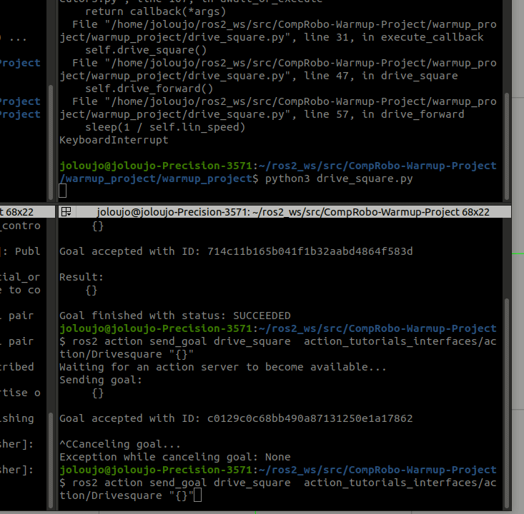
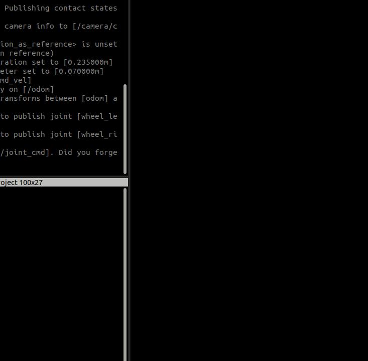
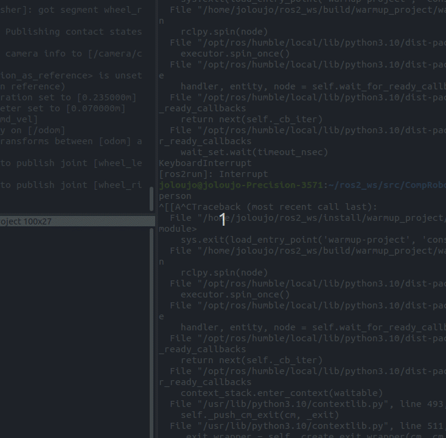
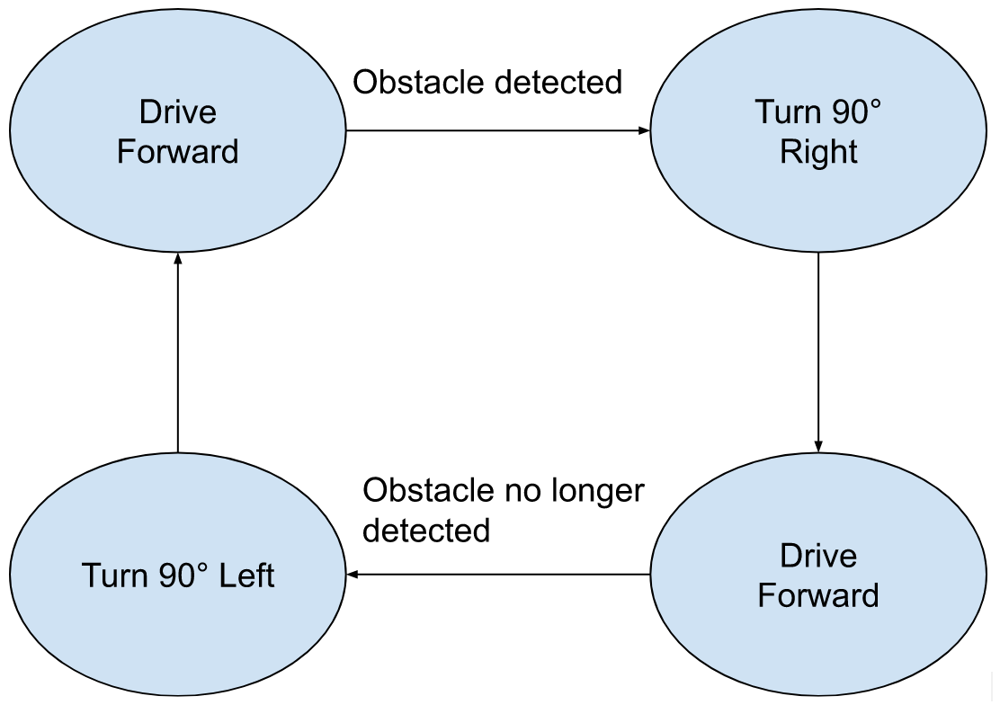
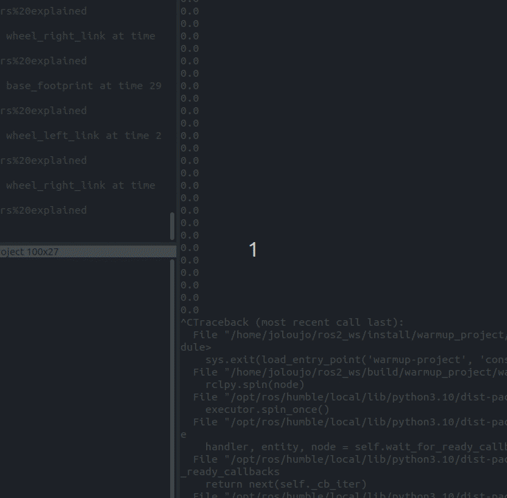
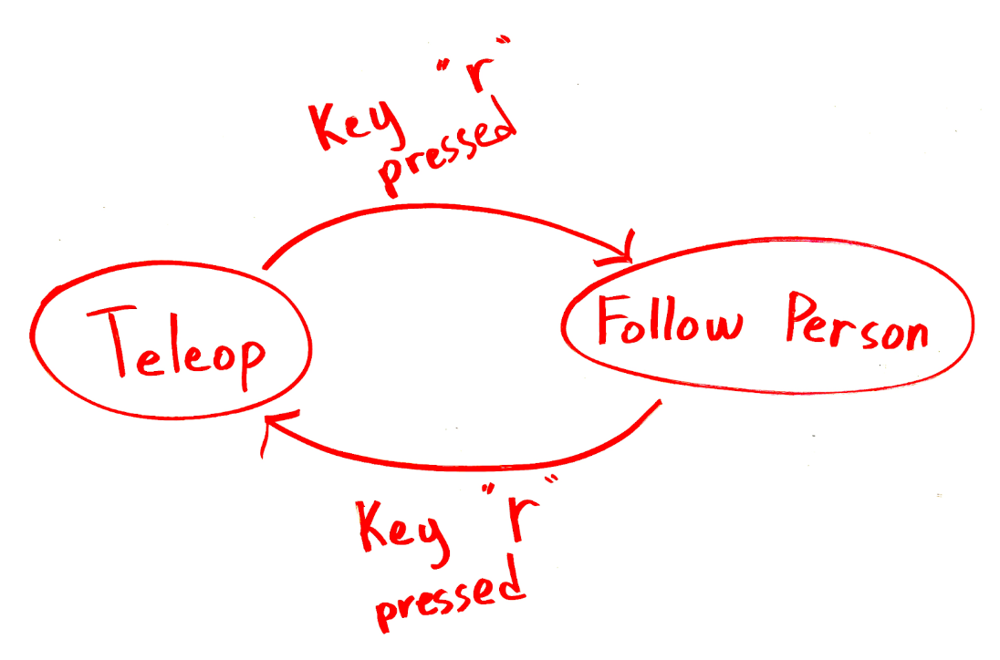

# CompRobo Warmup Project Report

Ben Tarr and Dominic Salmieri

# Robot Teleop

For teleoperation of the Neato, we first must get input from the user. Since keyboard input is a complicated task, we used the pre-existing library called `pynput` to detect key presses. Since we wanted to be able to detect simultaneous presses, we create a Python dictionary which stores the state of every key. Each time we receive a callback from `pynput`, we update the state dictionary. From our main loop in the teleop node, we check the state of the w, a, s, and d keys. From there, we set the variables for the forward and rotational velocity

# Driving in a Square

For this behavior, we needed to make the Neato drive in a one meter square. To do this, we used timed movements. To start, we had the Neato drive forward and measured the time it took to go one meter. It turned out that the linear control units for the Neato were very close to m/s. Based on this finding, we assumed the angular control units were in rad/s, and when we tested using the same guess and check method, we found we were correct.

Using this, we could calculate how long the Neato would take to move a certain distance or angle at a certain linear or angular velocity. We wrote a program that would command the Neato to repeatedly move and wait the correct amount of time to go forward one meter, then turn a quarter turn, then repeat that three more times. One drawback of the approach we took is that small errors in movement compound over distance. The timing of the commands wasn’t perfect, and the Neato would often be a few degrees off when turning. We tuned the linear and angular velocities that were used to improve accuracy, and found that a linear velocity of 0.2 m/s and an angular velocity of 0.5 rad/s had a good balance of speed and accuracy. Stopping briefly between moves also improved accuracy. A more accurate approach for this behavior would need to include some method of localization.

To create non-blocking, time-based code, we initially used the Python `threading` library. This worked very well, and allowed our node to send time-based commands to the Neato while still being able to do other things. We decided to change to using ROS actions for this behavior while working on our finite state machine because it was the perfect behavior to test on. It was simple, took a significant amount of time, and had an end. This approach felt much more ROSsy, and had more functionality, but ultimately didn’t end up being that different from `threading`. 

# Wall Following

To follow walls, we look at two angles on the left side of the robot: one 45 degrees to the front and one 45 degrees to the back. We find the distances to the closest object along these two angles by looking at the LIDAR data. We then find the difference in those angles and use that difference as the Neato’s angular velocity. This angular velocity is capped at a magnitude of 1 radian per second. The Neato then drives forward with this angular velocity.

In practice, this looks like the following. If the forward distance is less than the rear distance, then the Neato’s angular velocity will be set to be negative, and the Neato will turn away from the wall, and vice versa for flipped distances.

One of the drawbacks of this method of following a wall is that the distance to the wall can’t be controlled, but our approach could be modified to make this possible.

# Person Following

For this behavior, we had to make the Neato follow a moving target based on lidar data. To do this, we repeatedly filtered the points from the lidar scans to only include those within a rectangular zone in front of the Neato. We then calculated the center of mass of the points in this box and navigated towards that point using proportional control. When the target moved, the points would remain in the box, but the center of mass would move, and the Neato would navigate towards them, following the target.

The main drawback with this approach is that it doesn’t distinguish between stationary objects and the target. This means that if it gets too close to something large enough, it may just lock onto it and stop following the target. A possible fix to this would be to determine what points are stationary and what points are moving, and filter out stationary points so they aren’t considered.

One challenge we had with proportional control is getting a stable state when the goal is reached. The Neato will wiggle side to side once it has reached the target, which is adorable, but not optimal. This doesn’t pose a significant issue or affect the performance of our behavior, but it would be nice to change. One possible solution would be to switch from proportional control to PID control.

# Obstacle Avoidance

To implement obstacle avoidance, I implemented a simple version of an FSM within the node.

Here’s a visualization of it: \

For obstacle detection, I simply use the 0° and 90° (to the left) LiDAR data points. The threshold for an obstacle to be detected is 1 meter away from the Neato. This approach is relatively limited, but the concepts for how to implement more advanced behaviors are still present.

# Finite State Machine

The overall behavior for the finite state machine is person following with teleop to control the Neato in hard to navigate situations. The states are `teleop` and `person following` and the FSM switches between the two states when the “r” key is pressed. In the `teleop` state, the robot is controlled by the user via the keyboard, the same way our original robot teleop code works. In the `person following` state, the robot uses the same code as our person following behavior to follow whatever is in front of it. The intention of this FSM is to allow the Neato to be remotely recovered without stopping or restarting the program or picking up the Neato if it locks on to a wall.

To combine these two behaviors, we just copied the code from the two behavior files into a new `finite_state_machine.py` file. Any overlap or conflict between the two behaviors was resolved. This is a very simple and not very robust solution, but we weren’t able to implement this the way we were hoping to. We were initially planning to use ROS actions for our FSM. Our reasoning behind this was that actions could run asynchronously for long periods of time, and then be canceled when it needed to switch to a new behavior. We were able to get actions working, but got stuck when trying to read the lidar in an action. We couldn’t have blocking code because it would prevent the scan subscriber from getting data, but we needed to block the code to prevent the future from closing, because if it closed we wouldn’t be able to cancel the action.

Detecting when to transition between states is simple because it is based on key presses just like the teleop code. Using the same key detection system as the teleop code, the program switches between the two states every time the “r” key is pressed down.

# Code Structure

Each behavior of our project was its own node in its own file. This helped keep things organized and meant that we had very few merge conflicts while working asynchronously. It also helped keep the structure of each node more consistent. One drawback to this approach was that it meant code reusability was low. 

One quirk of our structure is that we actually have two packages in our repository. One is our main one, which is written in python and has all of the behaviors in it, and the other is one written in C++ for the action interfaces. This was confusing at first, but now it makes more sense.

# Challenges

We faced many challenges along the way, most of which are discussed in the relevant sections. The main challenge was our finite state machine, which we couldn’t implement how we wanted to. 

Another–less technical–challenge was finding time to meet. We both have very full schedules and finding time where both of us were available was very difficult. This made staying organized and pushing often incredibly important. We needed to divide up our work and complete it on our own schedules. This sometimes introduced some hiccups, but we were able to make this work fairly well overall.

# Improvements

Many of our solutions are not very robust. For example, the wall follower may break if some scan points aren’t collected, and the distance to the wall can’t be set. Also, the person follower can be distracted by walls and other stationary objects. The biggest improvement we could make would be to implement our finite state machine how we originally planned to.

Other improvements are discussed above in the relevant sections, for instance using PID control for person following or localization for driving in a square.

# Key takeaways

ROS structure: We learned how to structure a ROS project and how nodes interact with each other. This will be useful for many things we do in the future, both in this class and outside of it.

Actions: We learned how actions work, how to create and use them, and what their limitations are. This could be very helpful in the future, especially if we can overcome the challenges that we couldn’t solve in this project.

Threading: We learned how to run code asynchronously in Python. This is often needed and will be helpful for many different applications.

RViz and Gazebo: simulation and visualization are vital in the development process of a robot. We learned how to do both using Rviz and Gazebo
